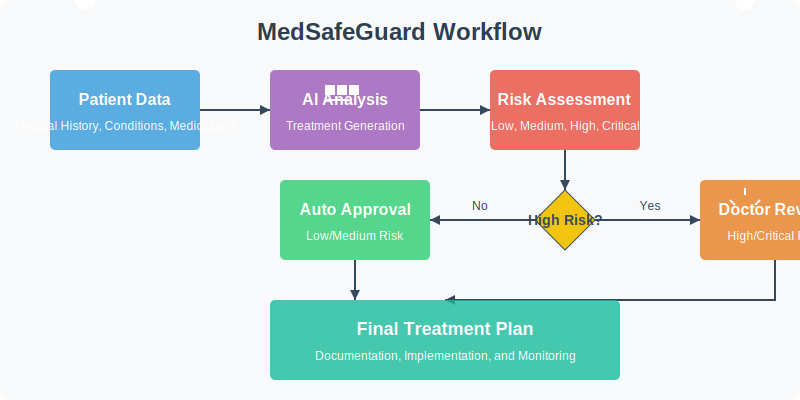

# MedSafeGuard


## AI-Powered Treatment Review with Human Oversight for Critical Decisions

MedSafeGuard combines AI efficiency with human medical expertise by automatically analyzing patient data, generating treatment recommendations, and streamlining the approval process based on risk level - only requiring physician confirmation for high-risk interventions.



## 🔍 Overview

MedSafeGuard is an innovative medical decision support system that demonstrates the power of AI and human collaboration in healthcare. The system analyzes patient medical records to generate evidence-based treatment recommendations while maintaining a critical human-in-the-loop safeguard for high-risk medical decisions.

### Key Features

- 🧠 **AI-powered analysis** of patient data to generate personalized treatment recommendations
- ⚖️ **Automatic risk assessment** categorization (low, medium, high, critical)
- ⚡ **Streamlined approval workflow** that respects physician time
- ✅ **Automatic approval** for low and medium risk treatments
- 👨‍⚕️ **Mandatory human confirmation** for high-risk and critical interventions
- 📋 **Comprehensive documentation** and treatment plan summaries
- 🔄 Built on **LlamaIndex's agent workflow technology** for reliable human-AI interaction

## 💻 Installation

### Prerequisites

- Python 3.9+
- OpenAI API key or compatible LLM service

### Setup

1. Clone the repository:

```bash
git clone https://github.com/yourusername/medsafeguard.git
cd medsafeguard
```

2. Create and activate a virtual environment:

```bash
python -m venv venv
source venv/bin/activate  # On Windows: venv\Scripts\activate
```

3. Install dependencies:

```bash
pip install -r requirements.txt
```

4. Create a `.env` file with your API keys:

```
OPENAI_API_KEY=your_api_key_here
```

## 🚀 Usage

Run the main script:

```bash
python medical_treatment_review.py
```

This will:
1. Initialize the system with mock patient data
2. Generate treatment recommendations using the LLM
3. Process each recommendation based on risk level
4. Request human confirmation for high-risk treatments
5. Generate a treatment plan summary

## 📊 Example Output

```
Generating treatment recommendations with AI...
Generated 3 treatment recommendations

Processing treatment: Metformin 500mg
Risk level: low
Low/medium risk treatment. Auto-approving...
Treatment Metformin 500mg has been automatically approved due to low risk level.

Processing treatment: Coronary Angioplasty
Risk level: high
High-risk treatment detected. Requesting human confirmation...

MEDICAL TREATMENT CONFIRMATION REQUIRED

Patient: John Doe (ID: P12345)
Age: 67

RECOMMENDED TREATMENT:
- Name: Coronary Angioplasty
- Category: procedure
- Description: Minimally invasive procedure to widen narrowed coronary arteries
- Risk Level: HIGH

POTENTIAL INTERACTIONS:
Risk increases with current anticoagulant therapy

ALTERNATIVES:
Medical management with anti-anginal medications, Coronary artery bypass graft

THIS TREATMENT REQUIRES EXPLICIT CONFIRMATION DUE TO ITS HIGH RISK LEVEL.

Dr. Smith, do you confirm this treatment? (yes/no/modify): yes

Result: Treatment Coronary Angioplasty has been approved by Dr. Smith.

===== TREATMENT PLAN SUMMARY =====
- Metformin 500mg: APPROVED
  Approved by: System (auto-approved)
  Approval date: 2025-04-23T14:30:45.123456
- Coronary Angioplasty: APPROVED
  Approved by: Dr. Smith
  Approval date: 2025-04-23T14:31:12.654321
```

## 🏗️ Project Structure

```
medsafeguard/
├── medical_treatment_review.py  # Main application file
├── requirements.txt             # Project dependencies
├── .env                         # Environment variables (not in repo)
├── LICENSE                      # License file
├── README.md                    # This file
└── assets/                      # Images and other assets
    └── medsafeguard-overview.png
```

## 🔮 Future Work

- Integration with Electronic Health Record (EHR) systems
- Addition of medical imaging analysis capabilities 
- Support for multi-specialty review workflows
- Pharmacy integration for approved medications
- Patient outcome tracking for continuous improvement

## 📄 License

This project is licensed under the MIT License - see the [LICENSE](LICENSE) file for details.

## 🙏 Acknowledgments

- Built with [LlamaIndex](https://www.llamaindex.ai/) for AI agent workflows
- Patient data and treatment examples are fictional and for demonstration purposes only
- This project is a proof-of-concept and not intended for clinical use without proper validation and regulatory approval
